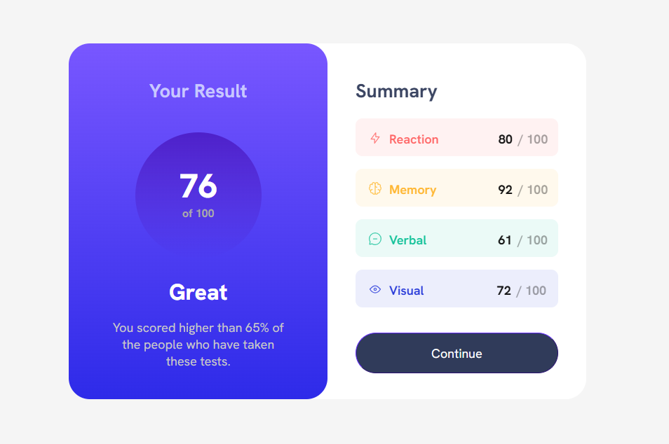

# Frontend Mentor - Results summary component solution

This is a solution to the [Results summary component challenge on Frontend Mentor](https://www.frontendmentor.io/challenges/results-summary-component-CE_K6s0maV). Frontend Mentor challenges help you improve your coding skills by building realistic projects. 

## Table of contents

- [Overview](#overview)
  - [The challenge](#the-challenge)
  - [Screenshot](#screenshot)
  - [Links](#links)
- [My process](#my-process)
  - [Built with](#built-with)
  - [What I learned](#what-i-learned)
  - [Continued development](#continued-development)
  - [Useful resources](#useful-resources)
- [Author](#author)
- [Acknowledgments](#acknowledgments)

## Overview
- This is a solution to the Results Summary Component Main challenge on Frontend Mentor. This is a newbie challenge. To do this challenge, you need a basic understanding of HTML, CSS and some JavaScript basics to read data from the JSON file. I have tried to get the solution looking as close to the design as possible

### The challenge

Users should be able to:

- View the optimal layout for the interface depending on their device's screen size
- See hover and focus states for all interactive elements on the page
- **Bonus**: Use the local JSON data to dynamically populate the content

### Screenshot



### Links

- Frontend Mentor Solution URL: (https://www.frontendmentor.io/solutions/fmnewbie-challengesrecipe-page-main-rjfgxnWjPw)
- Live Site URL: (https://noura201.github.io/Frontend_Mentor_01_Recipe_Page_Main_Challenge/)
- MyPersonal Linkedin URL: (https://www.linkedin.com/in/noura-mamdouh-8a81982a4/)

## My process

### Built with

- Semantic HTML5 markup
- CSS custom properties
- JavaScript basics

### What I learned

I have learned more while working through this project such as:

- Reading text & numeric data from JSON file
  Code:

```javascript
fetch("data.json")
      .then((Response) => Response.json())
      .then((data) => {
        document.getElementById("category_1").textContent = `${data[0].category_1}`;
        document.getElementById("score_1").textContent = `${data[0].score_1}`;
        })
      .catch((error) => console.error(`Error Fetching JSON:`, error));
```

- Reading more icons from the JSON file
  Code:

```javascript
fetch("data.json")
      .then((Response) => Response.json())
      .then((data) => {
        const iconOneURL = data[0].icon_1;
        const img1 = document.createElement("img");
        img1.src = iconOneURL;
        img1.alt = "IconOne";
        document.getElementById("icon_1").appendChild(img1);
        })
      .catch((error) => console.error(`Error Fetching JSON:`, error));
```

- Dealing with buttons and specifing some properties for them
  Code:

```css
.right-sec .continue-button {
    font-family: 'HankenGrotesk';
    font-size: large;
    height: 58px;
    width: 288.625px;
    margin: 15px 40px;
    border-radius: 30px;
    border-width: 1px;
    border-color: hsla(256, 72%, 46%, 1); 
    cursor: URL('assets/images/small_pointer.PNG'), pointer;
    color: white;
    background-color: hsl(224, 30%, 27%);
}
```

### Continued development

- I would like to train more about grouping multiple selectors perfectly to write a clean code and save more time and effort.
- I want to learn more about the important CSS Properties: Grid - Flexbox.
- I'm seeking to do more realistic projects to improve my coding skills.

### Useful resources

- When I faced an obstacle, I have searched on chatgpt to help me solve my problem.

## Author

- Github - [@NouraMamdouh](https://github.com/Noura201)
- Frontend Mentor - [@NouraMamdouh](https://www.frontendmentor.io/profile/Noura201)
- Linkedin - [@noura mamdouh](https://www.linkedin.com/in/noura-mamdouh-8a81982a4/)

## Acknowledgments

- I really have completed this challenge by myself.